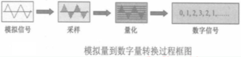

## ADC

### 硬件电路图

### ADC介绍

在51单片机系统内部运算时用的全部是数字量，即0和1，因此对单片机系统而言，我们无法直接操作模拟量，必须将模拟量转换成数字量。所谓数字量，就是用一系列
0和1组成的二进制代码表示某个信号大小的量。用数字量表示同一个模拟量时，数字位数可以多也可以少，位数越多则表示的精度越高，位数越少表示的精度就越低。

### ADC简介

ADC(Analog to digital converter)也称为模数转换器，是指一个将模拟信号转变为数字信号。单片机在采集模拟信号时，通常都需要在前端加上A/D芯片。

技术指标：

1. 分辨率

ADC的分辨率是指对于允许范围内的模拟信号，它能输出离散数字信号值的个数。这些信号值通常用二进制数来存储，因此分辨率常用作比特作为单位，且这些离散值的个数是2
的幂指数。

例如：12位的ADC的分辨率就是12位，或者说分辨率为满刻度的 1/(2^12)。一个10V满刻度的12位ADC能分辨输入电压变化最小值是 

**10V * 1/(2^12) = 2.4mV**。

2. 转换误差

转换误差通常是以输出误的最大值形式给出。它表示A/D转换器实际输出的数字量和理论上的输出数字量之间的差别。学用最低有效位的倍数表示。例如给出相对误差<=(+-)LSB/2，
这就表明实际输出的数字量和理论上应得到的输出数字量之间的误差小于最低位的半个字。

3. 转换速率

ADC的转换速率是能够重复进行数据转换的速度，即每秒转换的次数。而完一次A/D转换所需的时间(包括稳定时间)，则是转换速率的倒数。

### ADC转换原理

在A/D转换器中，因为输入的模拟信号在时间上是连续的，而输出的数字信号代码是离散的，所以A/D转换器在进行转换时，必须在一系列选定的瞬间(时间坐标轴上的一些规定点上)
对输入的模拟信号采样，然后再把这些采样值转换为数字量。因此，一般A/D转换过程是通过采样保持、量化和编码这三个步骤完成的，即首先对输入的模拟电压信号采样，
采样结束后进入保持时间，在这段时间内将采样的电压量转为数字量，并按一定的编码形式给出转换结果，然后开始下一次采样。

#### 采样定理

可以证明，为了正确无误地用下图中的采样信号Vs表示模拟信号Vi，必须满足

在满足采样定理条件下，可以用一个低通滤波器将信号Vs还原为Vi，这个低通滤波器的电压传输系数|A(f)|在低于f(imax)的范围内保持不变，而在f(s) - f(max)以前
应迅速下降为零。如下图所示，因此，采样定理规定了A/D转换的频率下限。

因此，A/D转换器工作时的采样频率必须高于所规定的频率。采样频率提高以后，留给A/D转换器每次进行转换的时间也相应缩短了，这就要求转换电路必须具备更快的工作速度。
因此，不能无限制地提高采样频率，通常取f(s)=(3-5)f(imax)已经能够满足要求。

因为每次把采样电压转换为相应的数字量都需要一定的时间，所以在每次采样以后，必须把采样电压保持一段时间。可见，进行A/D转换时所用的输入电压，实际上是每次采样
结束时的Vi值。

#### 量化和编码

我们知道，数字信号不公在时间上是离散的，而且数值上的变化不是连续的。这就是说，任何一个数字量的大小，都是以某个最小数量单位的整倍数来表示的。因此，在用数字量表示
采样电压时，也必须把它化成这个最小数量单位的整倍数，这个转化过程叫做量化。

所规定的最小数量单位叫做量化单位，用△表示。显然，数字信号最低有效位中的1表示的数量大小，就等于△。把量化的数值用二进制代码表示，称为编码。这个二进制代码就是
A/D转换的输出信号。

既然模拟电压是连续的，那么它就不一定能被△整除，因而不可避免地会引入误差，我们把这种误差称为量化误差。在把模拟信号划分为不同的量化等级时，用不同的划分方法
可以得到不同的量化误差。

假定需要把0~1V的模拟电压信号转换成三位二进制代码，这时便可以取△=(1/8)V，并规定凡数值在0~(1/8)V之间的模拟电压都当做0x△看待，用二进制的000表示：
凡数值在((1/8)~(2/8) V之间的模拟电压都当做1x△看待，用二进制的001表示，....)如下图所示，不难看出，最大的量化误差可达△，即(1/8)△。

为了减少量化误差，通常采用图(b)所示的划分方法，取量化单位△=(2/15)V，并将000代码所对应模拟电压规定为0~(1/15)V，即0~△/2。这时，最大量化误差将减少为
△/2=(1/15)V。因为现在把每个二进制代码所代表的模拟电压值规定为它所对应的模拟电压范围的中点，所以最大的量化误差自然就缩小为△/2了。

ADC内转换方式主要有以下2种：逐次逼近式ADC和双积分式ADC。

1. 逐次逼近式ADC

2. 双积分式ADC

### XPT2046芯片

XPT2046是一款4线制电阻式触摸屏控制器，内含12位分辨率125KHz转换速率逐步逼近型A/D转换器。XPT2046支持从1.5V到5.25V的低电压I/O接口。XPT2046能通过
执行两次A/D转换查出被按的屏幕位置，除此之外，还可以测量加在触摸屏上的压力。内部自带2.5V参考电压，可以作为辅助输入、温度测试和电池监测之用，电池监测的电压
范围可以从0V到6V。XPT2046片内集成有一个温度传感器。在2.7V的典型工作状态下，关闭参考电压，功耗可小于0.75mW。XPT2046采用微波的封装形式:TSSOP-16，
QFN-16和VFBGA-48。

工作温度范围为-40度~+80度。与ADS7846、TSC2046、AK4182A完全兼容。

1. 主要特性
* 工作电压范围为1.5V~5.25V
* 支持1.5V~5.25V的数字I/O口
* 内建2.5V参考电压源
* 电源电压测量(0V~6V)
* 内建结温测量功能
* 触摸压力测量
* 采用3线制SPI通信接口
* 具有自动省电功能

2. 芯片管脚说明

|QFN引脚号|TSSOP引脚号|VFBGA引脚号|名称|说明|
|:-----:|:------:|:------:|:-----:|:-------|
|1|13|A5|BUSY|忙时信号线。当CS(低)为高电平时为高阻状态|
|2|14|A4|DIN|串行数据输入端。当CS(低)为低电平时，数据在DCLK上升沿锁存进来|
|3|15|A3|CS(低)|片选信号。控制转换时序和使能串行输入输出寄存器，高电平时ADC掉电|
|4|16|A2|DCLK|外部时钟信号输入|
|5|1|B1和B2|VCC|电源输入端|
|6|2|D1|XP|XP位置输入端|
|7|3|E1|YP|YP位置输入端|
|8|4|G2|XN|XN位置输入端|
|9|5|G3|YN|YN位置输入端|
|10|6|G4和G5|GND|GND|
|11|7|G6|Vbat|电池监视输入端|
|12|8|E7|AUX|ADC辅助输入通道|
|13|9|D7|Vref|参考电压输入/输出|
|14|10|C7|IOVDD|数字电源输入端|
|15|11|B7|PENIRQ(低)|笔接触中断引脚|
|16|12|A6|DOUT|串行数据输出端。数据在DCLK的下降沿移出，当CS(低)高电平时为高阻状态|