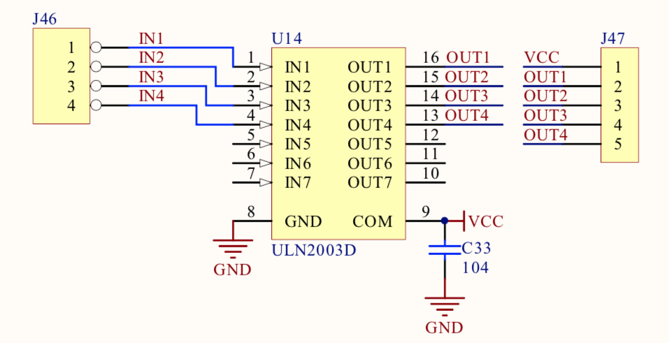
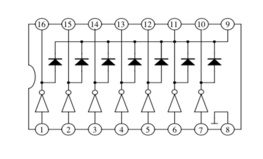
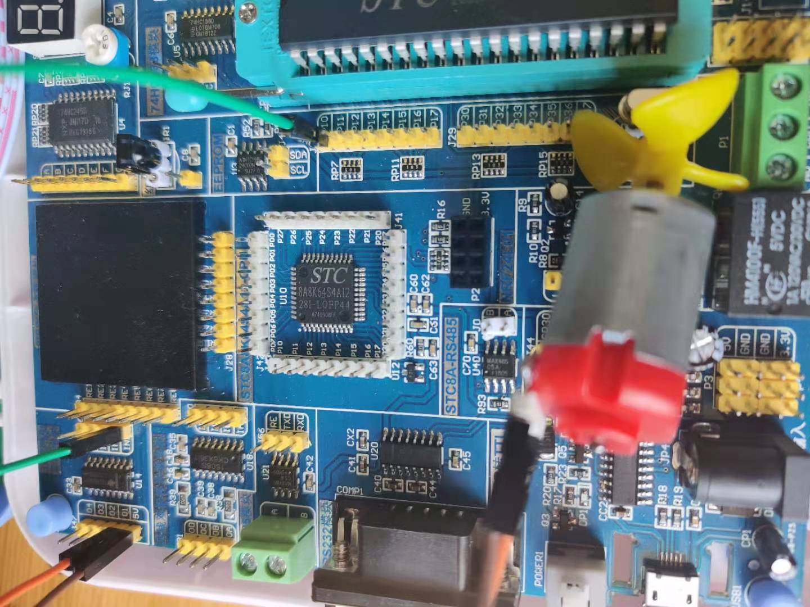

## 五线四项直流电机

### 电路原理图


### ULN2003D芯片 

如果使用GPIO管脚直接驱动大功率器件是不可以的，这样容易烧坏电路板，必须搭建外部驱动电路。

ULN2003是一个单片高电压、高电流的达林顿晶体管阵列集成电路。它是由7对NPN达林顿组成的，它的高电压输出我和阴极箝位二极管可以转换感应负载。
单个达林顿对的集电极电流是500mA。达林顿并联可以承受更大的电流。



### 接线图



### 关键代码
```c
    // 这里注意ULN2003芯片的逻辑图，是一个非门，0->代表高电平，1->代表低电平
    MOTO = 0;
    for (i=0; i<100; i++) {
        MOTO = 1;
        delay(5000);
    }

    MOTO = 0;
```