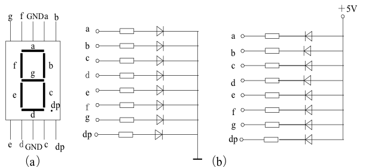
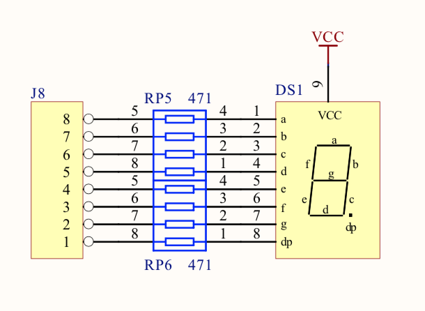
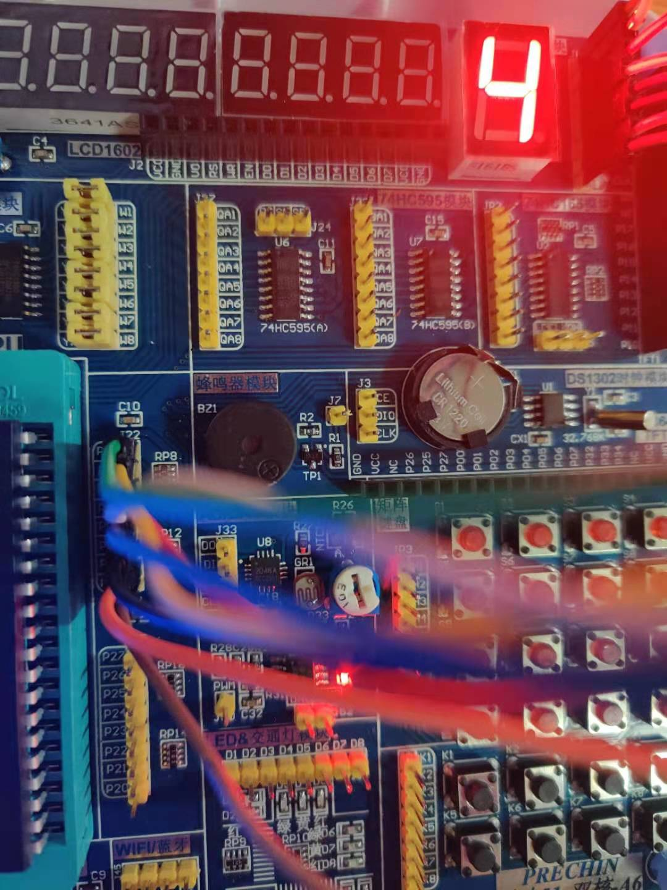

## 数码管

单片机系统中常用的显示器有:

发光二极管LED(Light Emitting Diode)显示器、液晶LCD(Liquid Crystal Display)显示器、TFT液晶显示器等。LED显示器有两种显示结构：
段显示(7段、米字型等)和点阵显示(5x8、8x8点阵等)。

LED数码管根据LED不同的接法可以分为2类，共阴和共阳。



使用LED显示器时，要注意区分两种不同的接法。为了显示数字或字符，必须对数字或字符进行编码。七段数码管加上一个小数点，共计8段。因此为LED显示器
提供的编码正好是一个字节。

### 静态显示管

静态显示的特点是每个数码管的段选必须接一个8位数据线来保持显示的字形码。当送入一次字形码后，显示字形可一直保持，直到送入新字形码为止。这种方法的
优点是占用CPU时间少，显示便于监测和控制。缺点是硬件电路比较复杂，成本较高。

#### 电路图


#### 原理

1. 从电路上看是共阳，就是说并联接地，当给出低电平信号之后，会接通LED。
2. 若接在P0组，共8个端口，正好是一个字节。
3. 从a -> dp编码分别是0 - 7。

#### 接线


#### 代码关键点
```c

#define DS P0

// 这里需要注意的点是从左往右看，第一位表示的是 P07接口，而不是以左往右看。

// 1100 0000 0
#define ZERO 0xC0
// 1111 1001 1
#define ONE 0xF9
// 1010 0100 2
#define TWO 0xA4
// 1011 0000 3
#define THREE 0xB0
// 1001 1001 4
#define FOUR 0x99
// 1001 0010 5
#define FIVE 0x92

...
```