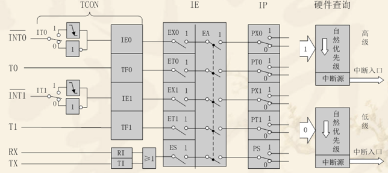
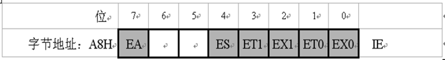
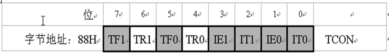
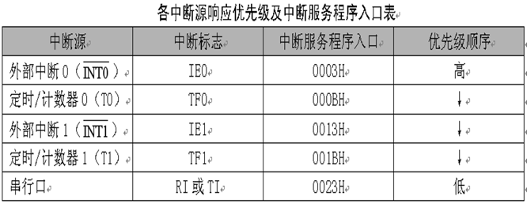
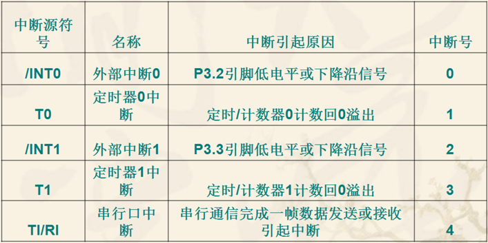

## 中断

### 中断概念

对于单片机来讲，中断是指CPU在处理某一事件A时，发生了另一事件B，请求CPU迅速去处理（中断发生）；CPU暂时停止当前的工作（中断响应），转去
处理事件B（中断服务）；待CPU将事件I处理完后，再回到原来事件A被中断的地方继续处理事件A（中断返回），这一过程称为中断。

### 中断结构及相关寄存器
STC89C5X系统单片机提供了8个中断请求源，它们分别是：外部中断0(INT0)、外部中断1（INT1）、外部中断2（INT2）、外部中断3（INT3）、
定时器0中断、定时器1中断、定时器2中断、串口（UART）中断。

所有的中断都具有四个中断优先级，用户可以用关总中断允许位（EA/IE.7）或相应中断的允许位来屏所有的中断请求，也可以用打开相应的中断允许位来使
CPU响应相应的中断申请。基中有些中断源可以用软件独立地控制为开中断或关中断状态，每一个中断的优先级别均可用软件设置。高优先级的中断请求可以
打断低优先级的中断，反之，低优先级中断请求不可以打断高优先级及同优先级的中断。当两个相同优先级的中断同时产生时，将由查询次序来决定系统响应
哪个中断。



1. INT0对应的是P3.2口的附加功能，可由IT0(TCON.0)选择其为低电平有效还是下沿有效。当CPU检测到P3.2引脚上出现有效的中断信号时，中断
标志IE0(TCON.1)置1，向CPU申请中断。
   
2. INT1对应的是P3.3口的附加功能，可由IT1(TCON.2)选择其为低电平有效还是下沿有效。当CPU检测到P3.3引脚上出现有效的中断信号时，中断
标志IE1(TCON.3)置1，向CPU申请中断。
   
3. T0对应的是P3.4口的附加功能，TF0(TCON.5)，片内定时/计数器T0溢出中断请求标志。当定时/计数器T0发生溢出时，置位TF0，并向CPU申请中断。

4. T1对应的是P3.5口的附加功能，TF1(TCON.7)，片内定时/计数器T1溢出中断请求标志。当定时/计数器T1发生溢出时，置位TF1，并向CPU申请中断。

5. RXD和TXD分别对应的是P3.0和P3.1品的附加功能，RI(SCON.0) 或 TI(SCOn.1)，串行口中断请求标志。当串行品接收完一帧串行数据时置位RI
或当串行口发送完一帧串行数据时置位TI，向CPU申请中断。
   
#### 中断允许控制
CPU 对中断系统所有中断以及某个中断源的开放和屏蔽是由中断允许寄存器IE控制的。


* EX0(IE.0)，外部中断0允许位；
* ET0(IE.1)，定时/计数器T0中断允许位；
* EX1(IE.2)，外部叫断0允许位；
* ET1(IE.3)，定时/计数器T1中断允许位；
* ES(IE.4)，串行口中断允许位；
* EA(IE.7)，CPU中断允许(总允许位)。

#### 中断请求标志TCON


* IT0(TCON.0)，外部中断0触发方式控制位。
    当IT0=0时，为电平触发方式。
    当IT0=1时，为边沿触发方式（下降沿有效）。
* IE0(TCON.1)，外部中断0中断请求标志位。 
* IT1(TCON.2)，外部中断1触发方式控制位。
* IE1(TCON.3)，外部中断1中断请求标志位。
* TF0(TCON.5)，定时/计数器T0溢出中断请求标志位。
* TF1(TCON.7)，定时/计数器T1溢出中断请求标志位。

#### 中断优先级
同一优先级中的中断申请不止一个时，则有中断优先权排队问题。同一优先级的中断优先权排队，由中断系统硬件确定的自然优先级形成。


#### 中断信号


#### 中断响应条件
1. 中断源有中断请求；
2. 此中断源的中断允许位为1；
3. CPU开中断(EA = 1)。

以上三条件同时满足时，CPU才有可能响应中断。在使用中我们需要做什么呢？
1. 你想使用的中断是哪个？选择相应的中断号；
2. 你所希望的触发条件是什么？
3. 你希望在中断之后干什么？

我们以外部中断0为例
```c
EA = 1; // 打开总中断开关
EX0 = 1; // 打开外部中断0
IT0 = 0 / 1;  // 设置外部中断的触发方式

// 中断服务函数
void int0() interrupt 0 using 1
{
    // ....
}
```