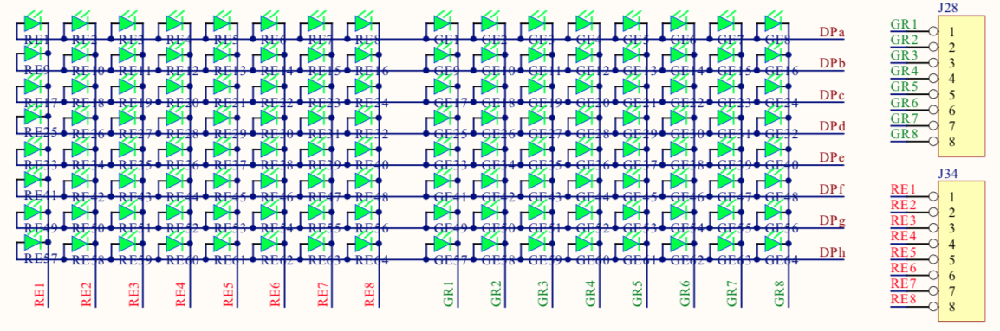
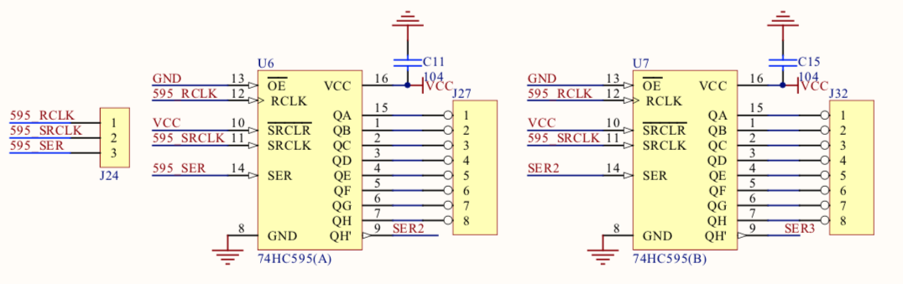
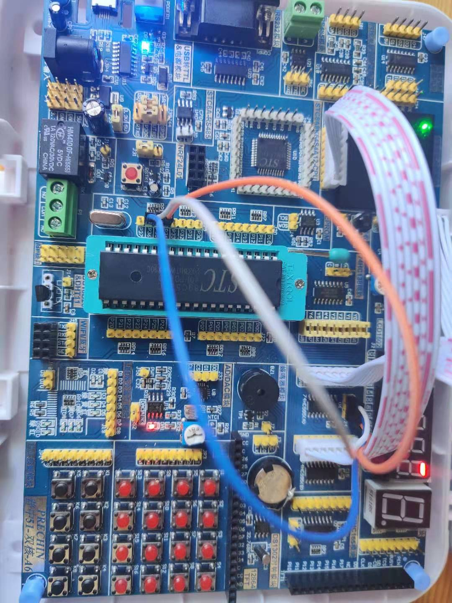

## 8*8LED双色点阵

### 电路原理图


### 原理
* 需要使用74HC595芯片去处理这么多接口问题。
* 所有LED阳极都串联在一起，DPa -> DPh施加一个高电平，控制LED点亮是通过阴极的RE1->RE8以及GE1->GE8来进行控制。
* DPa -> DPh 参考[74HC245/动态数码管实验那里的电路图](../ds/README.md)



### 接线


### 点亮第一个LED代码关键点
```c
    uchar data1, data2;
    // 注意这里写入的顺序跟接线口有关
    data1 = 0xFE;
    data2 = 0x01;

    while (1) {
        writeHC595Data(data1, data2);
        delay(100);
    }
```

### 显示图形
```c
    uchar ledNegative[] = {0x0C, 0x1E, 0x3E, 0x7C, 0x7C, 0x3E, 0x1E, 0x0C};
    uchar ledPositive[] = {0x7F, 0xBF, 0xDF, 0xEF, 0xF7, 0xFB, 0xFD, 0xFE};

    int i;

    while (1) {
        for (i=0; i<8; i++) {
            writeHC595Data(ledPositive[i], ledNegative[i]);
            delay(10);
        }
    }
```

### 动态显示图形
