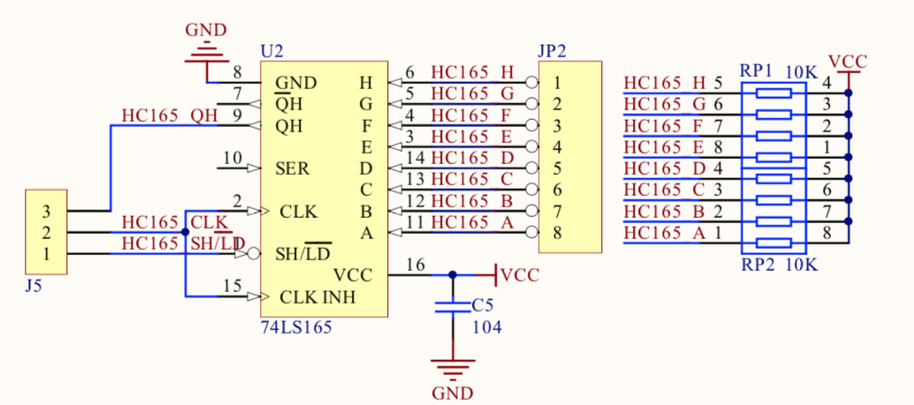
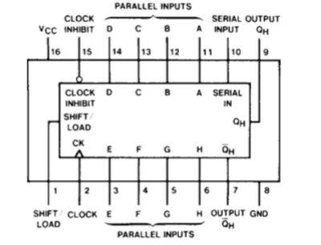
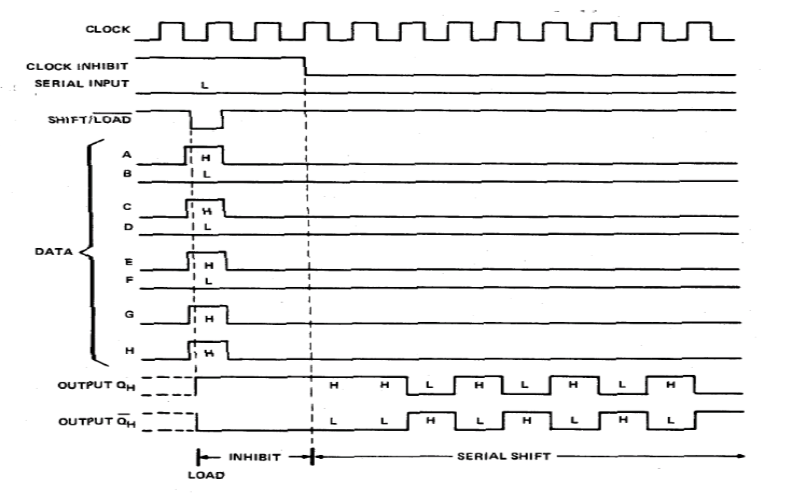
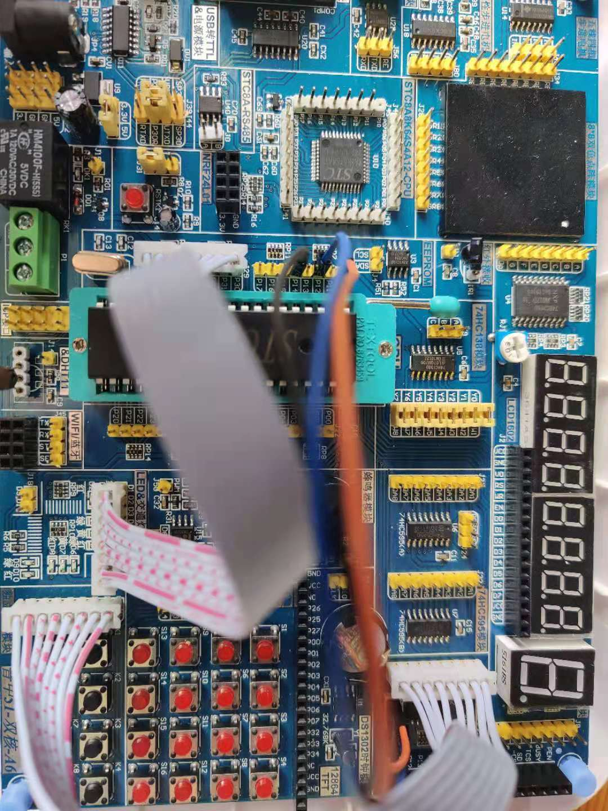

## IO扩展(并转串)

### 基本电路图


### 76HC165芯片



#### 功能表
|Shift/Load|Clock Inhibit|Clock|Serial|Parallel(A-H)|Qa(Internal Outputs)|Qb(Internal Outputs)|Qh(output)|
|:--------:|:-----------:|:---:|:----:|:-----------:|:------------------:|:------------------:|:--------:|
|L|X|X|X|a....h|a|b|h|
|H|L|L|X|X|Qa0|Qb0|Qh0|
|H|L|↑|H|X|H|Qan|Qgn|
|H|L|↑|L|X|L|Qan|Qgn|
|H|H|X|X|X|Qa0|Qb0|Qh0|

#### 时序图


#### 原理
* SHIFT/LOAD给出一个低电平，表示开始输入信号。
* A-H开始进行数据输入，这时候给出的信号会移至寄存器，类似于一个栈，压入数据，后进先出。
* 输入完成之后就可以开始读取信号数据。
* 那么读取数据需要一个时钟信号，每一个周期会从栈中取一次数据。

### 接线


### 关键代码
```c
    // sdcc里并没有_nop_函数(keil)，这里需要宏定义一个。
    #define _nop_() __asm nop __endasm
    
    LC = 0;
    _nop_();
    LC = 1;

    indata = 0;
    /*
     * CLK控制0 -> 1来实现时钟数据。来读取数据
     */
    for (i=0; i<8; i++) {
        indata = indata << 1;
        CLK = 0;
        _nop_();
        indata |= QH;
        CLK = 1;
    }
```