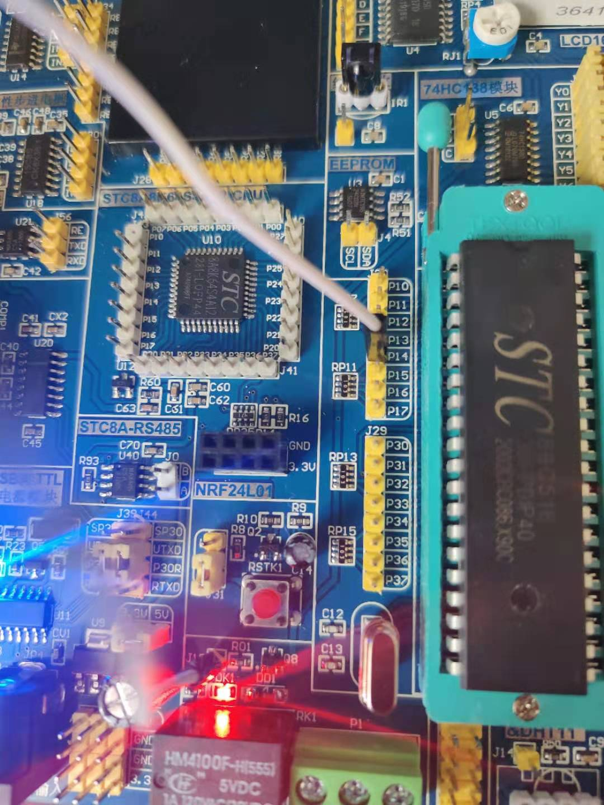

## 继电器

### 基本电路


### 原理
继电器(英文名称: relay)是一种电控制器件，是当输入量（激励量）的变化达到规定要求时，在电器输出电路中使被控量发生预定的阶跃变化的一种是电器。
它具有控制系统（又称输入回路）和被控制系统（又称输出回路）之间的互动关系。通常应用于自动化的控制电路中，它实际上是用小电流去控制大电流运作的一种
"自动开关"。帮在电路中起着自动调节、安全保护、转换电路等作用。

继电器内部含有线圈和触点，当线圈得电就会使触点吸合。

注意DD1 这里是蓄流电路，当断电之后，继电器中线圈产生的电流会被这里吸收以防对三极等其他原件造成击穿。

1. 当给低电平之后，PNP三极管会导通。触发继电器。

### 接线


### 代码关键点
```c
#include <8052.h>

#define RELAY P1_4

// 控制方法与LED那边一致
void main()
{
    RELAY = 0;
    for (;;) {}
}
```