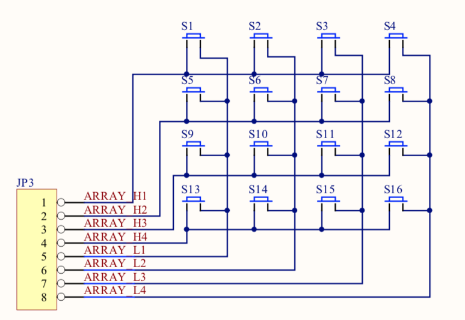
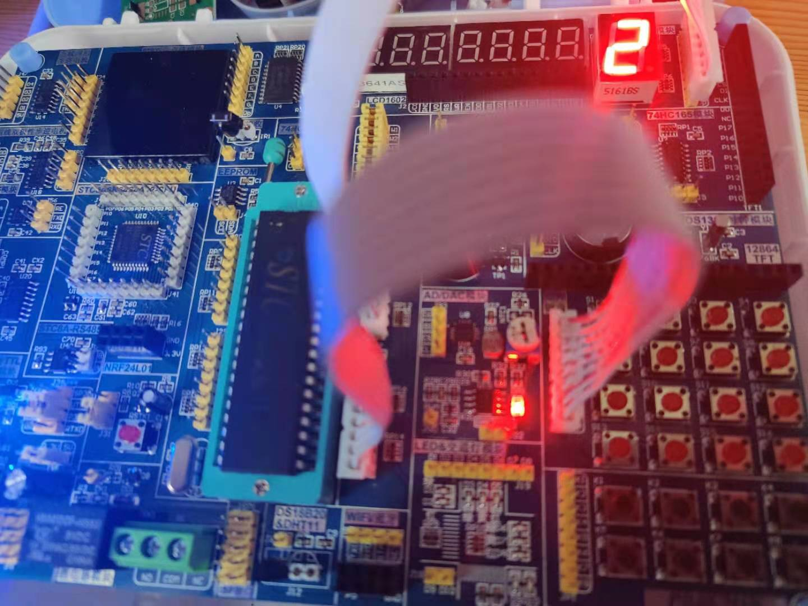

## 联合按钮

### 电路图


### 原理
1. 可以从电路图可以看出来，总共4行，端口 1-4是表示行，然后每一列另一端并联接 5-8口。
2. 那么就可以通过两个信号得到是哪个按钮被按下。

如何检测按键是被按下呢？
* 逐行扫描： 我们可通过高四位轮流输出低电平来对矩阵键盘进行逐行扫描，当低四位接收到数据不全为1的时候，说明按键按下，然后通过接收到的数据
是哪一位为0来判断是哪一个按键被按下。
* 行列扫描：我们可以通过高四位全部输出低电平，低四位输出高电平。当接收到的数据，低四位不全为高电平时，说明有按键按下，然后通过接收的数据值，
判断是哪一列有按键按下，然后再反过来，高四位输出高电平，低四位输出低电平，然后根据接收到的高四位的值判断是哪一行有按键按下，这样就能够确定
  是哪一个按键按下了。
  
### 接线图


### 代码关键点
```c
 if (UNIBTN != 0x0F) {
  // 确定列
  UNIBTN = 0x0F;
  switch (UNIBTN) {
      // 第一列下面依次类推
      case 0x07:
          dsIndex = 0;
          break;
      case 0x0B:
          dsIndex = 1;
          break;
      case 0x0D:
          dsIndex = 2;
          break;
      case 0x0E:
          dsIndex = 3;
          break;
  }

  // 确定行
  UNIBTN = 0xF0;
  switch (UNIBTN) {
      // 第一行下面依次类推
      case 0x70:
          break;
      case 0xB0:
          dsIndex += 4;
          break;
      case 0xD0:
          dsIndex += 8;
          break;
      case 0xE0:
          dsIndex += 12;
          break;
  }
```