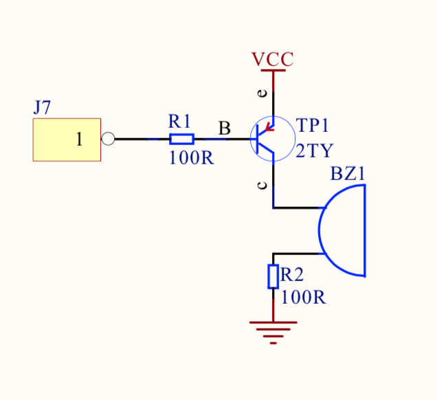
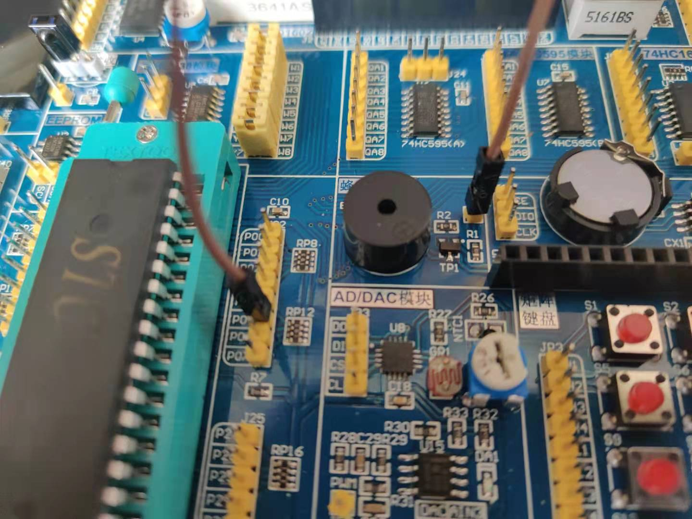

## 蜂鸣器

### 基本电路


### 原理
1. 蜂鸣器有一个工作振荡频率。
2. 当控制电平为振荡波形时就会发出声音。
3. 通过三极管来放大信号。

相当于`0 1 0 1 0 1 0 1`脉冲信号。

* 在单片机应用的设计上，很多方案都会用到蜂鸣器，大部分都是使用蜂鸣器来做提示或报警，比如按键按下、开始工作、工作结束或是故障等等。
* 自激蜂鸣器是直流电压驱动的，不需要利用交流信号进行驱动，只需对驱动口输出戏动电平并通过放大电路放大戏动电流就能使蜂鸣器并发出声音，非常简单。
* 改变单片机引脚输出波形的频率，就可以调整控制蜂鸣器单调，产生种不同单色、单调的声音。
* 改变输出电平的高低电平占空比，则可以控制蜂鸣器的声音大小。

### 接线


### 代码关键点 
```c
#define BEEP P0_5
// keil可以写为
// BEEP = ~BEEP;
// 但在sdcc下，我测试不可以需要写成以下形式
BEEP = 0;
BEEP = !BEEP;

// 那么如何表示振荡频率呢？
while (1) {
    BEEP = !BEEP;
    delay(10);
}
```