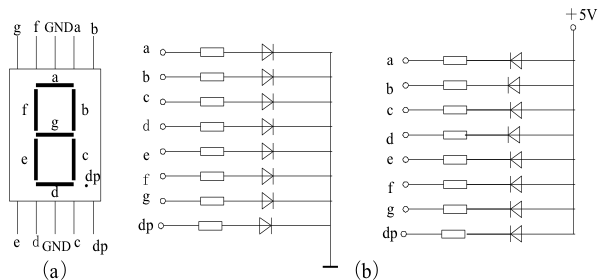
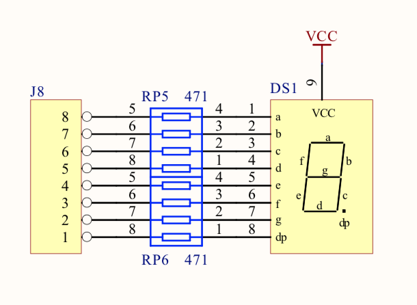
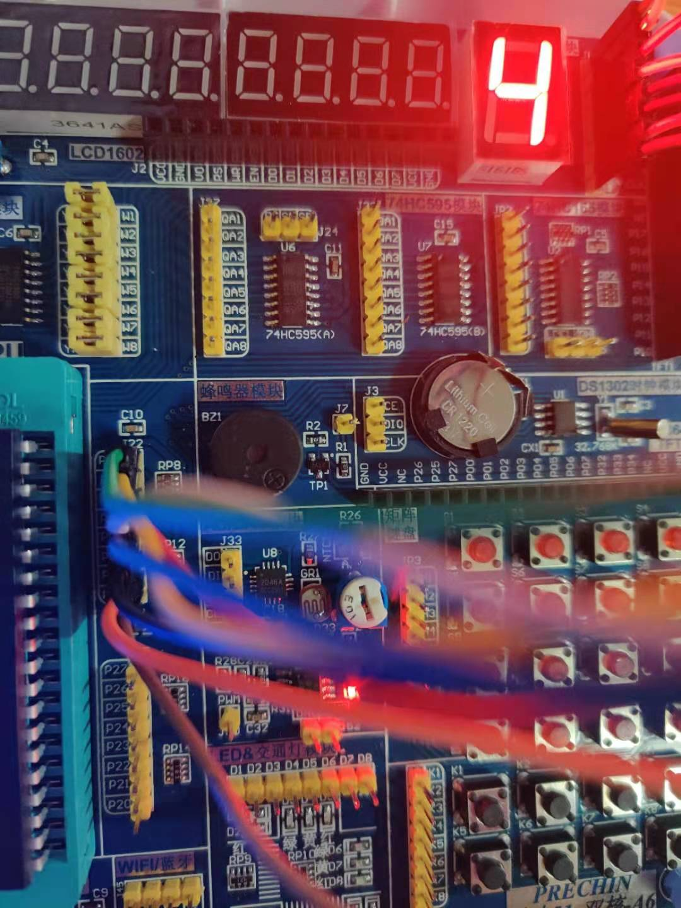
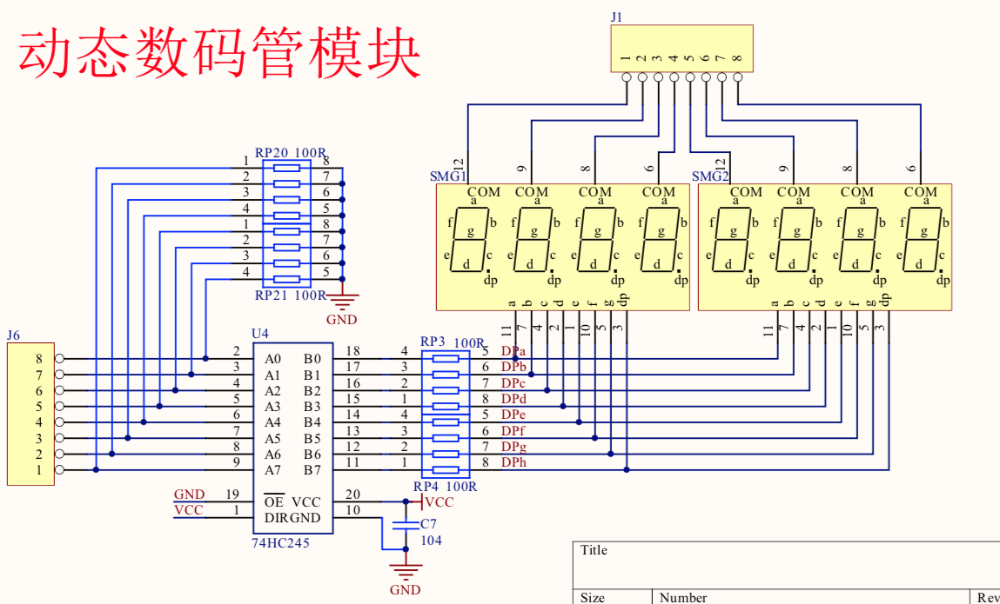
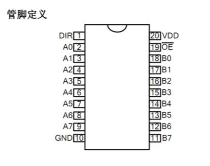
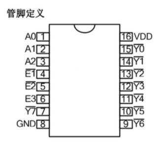
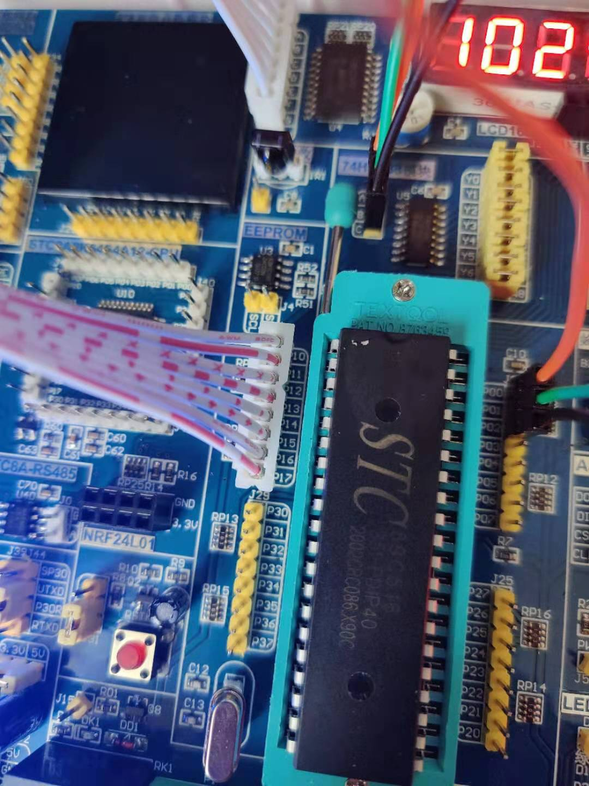

## 数码管

单片机系统中常用的显示器有:

发光二极管LED(Light Emitting Diode)显示器、液晶LCD(Liquid Crystal Display)显示器、TFT液晶显示器等。LED显示器有两种显示结构：
段显示(7段、米字型等)和点阵显示(5x8、8x8点阵等)。

LED数码管根据LED不同的接法可以分为2类，共阴和共阳。



使用LED显示器时，要注意区分两种不同的接法。为了显示数字或字符，必须对数字或字符进行编码。七段数码管加上一个小数点，共计8段。因此为LED显示器
提供的编码正好是一个字节。

### 静态显示管

静态显示的特点是每个数码管的段选必须接一个8位数据线来保持显示的字形码。当送入一次字形码后，显示字形可一直保持，直到送入新字形码为止。这种方法的
优点是占用CPU时间少，显示便于监测和控制。缺点是硬件电路比较复杂，成本较高。

#### 电路图


#### 原理

1. 从电路上看是共阳，就是说并联接地，当给出低电平信号之后，会接通LED。
2. 若接在P0组，共8个端口，正好是一个字节。
3. 从a -> dp编码分别是0 - 7。

#### 接线


#### 代码关键点
```c

#define DS P0

// 这里需要注意的点是从左往右看，第一位表示的是 P07接口，而不是以左往右看。

// 1100 0000 0
#define ZERO 0xC0
// 1111 1001 1
#define ONE 0xF9
// 1010 0100 2
#define TWO 0xA4
// 1011 0000 3
#define THREE 0xB0
// 1001 1001 4
#define FOUR 0x99
// 1001 0010 5
#define FIVE 0x92

...
```

### 动态数码管

动态显示的特点是将所有数码管的段选线并联在一起，由位选线控制是哪一位数码管有效。选亮数码管采用动态扫描显示。所谓动态扫描显示就是轮流向各位数码管
送出字形码和相应的选位，利用发光管的余辉和人眼视觉暂留作用，使人的感觉好像各位数码管同时都在显示。动态显示的亮度要比静态显示要差一些，所以在
选择限流电阻时应略小于静态显示电路中的。

#### 电路图


**D74HC245芯片**



管脚定义说明

|符号|管脚名称|管脚号|说明|
|:----|:----|:----|:----|
|A0-A7|数据输入/输出|2-9|x|
|B0-B7|数据输入/输出|18-11|x|
|OE(低)|输出使能|19|x|
|DIR|方向控制|1|DIR=1, A->B DIR=0, B->A|
|GND|逻辑地|20|逻辑地|
|VDD|逻辑电源|10|电源端|

真值表

|输出使能|输出控制|工作状态|
|:----:|:----:|:----:|
|OE口|DIR|x|
|L|L|Bn输入 An输出|
|L|H|An输入 Bn输出|
|H|x|高阻态|

**D74HC138**



此芯片用于数字电路中的3-8译码功能

管脚说明

|名称|功能说明|管脚号|
|:----|:----|:----|
|Y0(低压)-Y6(低压),Y7(低压)|数据输出|15-9,7|
|A0-A2|数据输入|1-3|
|E1(低压), E2(低压), E3|使能控制|4-6|
|VDD|逻辑电源|16|
|GND|逻辑地|8|

真值表

|E1(低)|E2(低)|E3|A0|A1|A2|左为输入-右为输出|Y0|Y1|Y2|Y3|Y4|Y5|Y6|Y7|
|:----:|:----:|:----:|:----:|:----:|:----:|:----:|:----:|:----:|:----:|:----:|:----:|:----:|:----:|:----:|
|H|X|X|X|X|X|-|H|H|H|H|H|H|H|H|
|X|H|X|X|X|X|-|H|H|H|H|H|H|H|H|
|X|X|L|X|X|X|-|H|H|H|H|H|H|H|H|
|L|L|H|L|L|L|-|L|H|H|H|H|H|H|H|
|L|L|H|H|L|L|-|H|L|H|H|H|H|H|H|
|L|L|H|L|H|L|-|H|H|L|H|H|H|H|H|
|L|L|H|H|H|L|-|H|H|H|L|H|H|H|H|
|L|L|H|L|L|H|-|H|H|H|H|L|H|H|H|
|L|L|H|H|L|H|-|H|H|H|H|H|L|H|H|
|L|L|H|L|H|H|-|H|H|H|H|H|H|L|H|
|L|L|H|H|H|H|-|H|H|H|H|H|H|H|L|

#### 原理

1. 观察电路图***74HC245***这个芯片在设计的时候，*DIR*口已经连接了VCC，说明就是通过An->Bn来输入信号。
2. 数码管是通过位管来控制的，当位电位为低平时，表示这个位置上的数码管被控制。
3. ***74HC138***来控制位，其他正常输出电平信号。
4. 总共8个数码管，全部并连导通。

#### 接线


#### 代码关键点
```c
    // 这里为共阴接法，所以注意是输出高电平才可以正确点亮
    const u8 numberArr[] = {0x3F, 0x06, 0x5B, 0x4F, 0x66, 0x6D, 0x7D, 0x07, 0x7F};
```