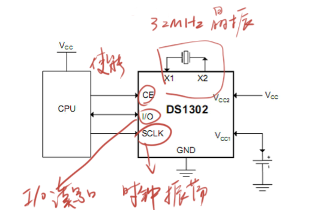
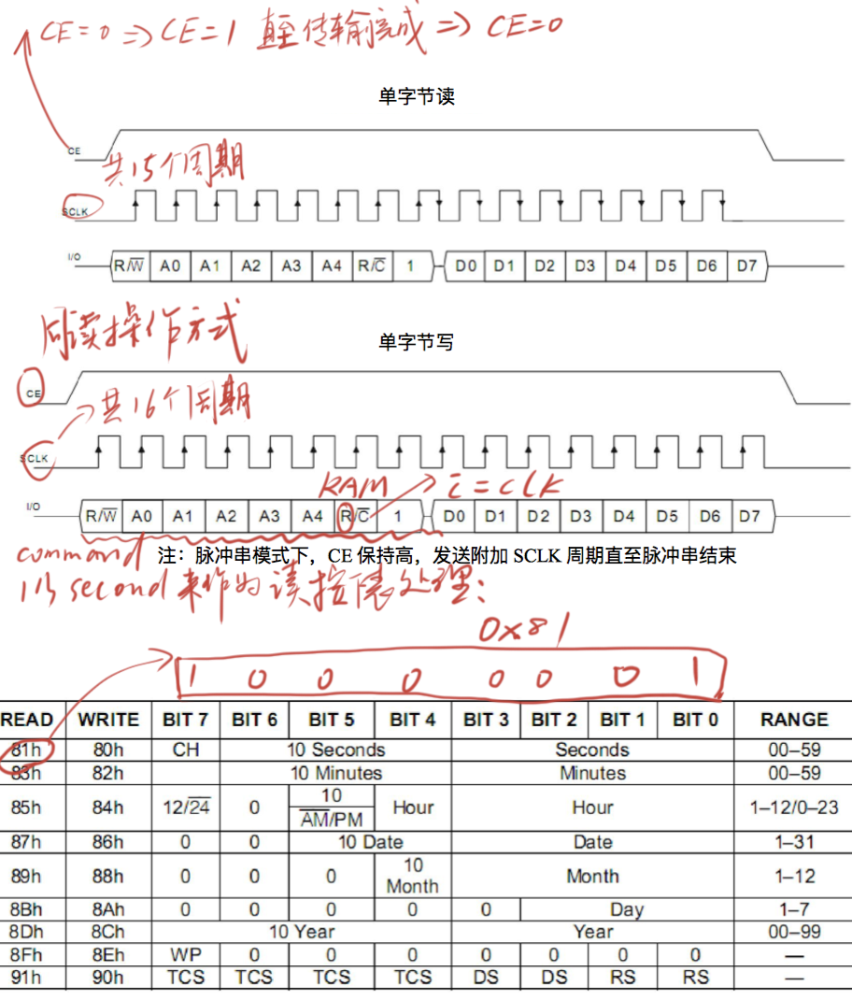

## DS1302时钟

### 芯片管脚图

|管脚|名称|功能|
|:----:|:----:|:----|
|1|	VCC2|双供电配置中的主电源供应管脚，V CC1连接到备用电源，在主电源 失效时保持时间和日期数据.DS1302工作于 V CC1和 V CC2中较大者. 当 V CC2比 V CC1高 0.2V时，V CC2给 DS1302供电.当 V CC1比 V CC2高 时,V CC1给 DS1302供电.|
|2|	X1	|与标准的32.768kHz石英晶体相连.内部振荡器被设计与指定的6pF 装载电容的晶体一起工作.更多关于晶体选择和布局注意事项的信 息请参考应用笔记 58页:Dallas实时时钟晶振注意事项.DS1302也可以被外部的 32.768kHz振荡器驱动.这种配置下,X1与 外部震荡信号连接，X2悬浮.|
|3|X2||
|4|	GND|	电源地|
|5|	CE|	输入.CE信号在读写时必须保持高电平.此管脚内部有一个 40kΩ(典 型值)的下拉电阻连接到地.注意:先前的数据手册修正把 CE当作 RST.管脚的功能没有改变.|
|6|	I/O|	输入/推挽输出.I/O管脚是三线接口的双向数据管脚.此管脚内部有 一个 40kΩ(典型值)的下拉电阻连接到地.|
|7|	SCLK|	输入. SCLK 用来同步串行接口上的数据动作.此管脚内部有一个 40kΩ(典型值)的下拉电阻连接到地.|
|8|	VCC1|	低功率工作在单电源和电池工作系统和低功率备用电池.在使用涓流 充电的系统中，这个管脚连接到可再充能量源.UL认证在使用锂电池 时确保避免反向充电电流.详见 www.maximic.com/TechSupport/QA/ntrl.htm.|

### 时序图

### BCD码
* BCD码(Binary Coded Decimal)，用4位二进制数来表示1位十进制数
* 例: 0001 0011 表示13，1000 0101 表示85，0001 1010  不合法
* 在十六进制中的体现：0x13表示13，0x85表示85，0x1A不合法
* **BCD码转十进制**: DEC = BCD/16 * 10 + BCD % 16; (2位BCD)
* **十进制转BCD码**: BCD = DEC/10 * 16 + DEC % 10; (2位BCD)