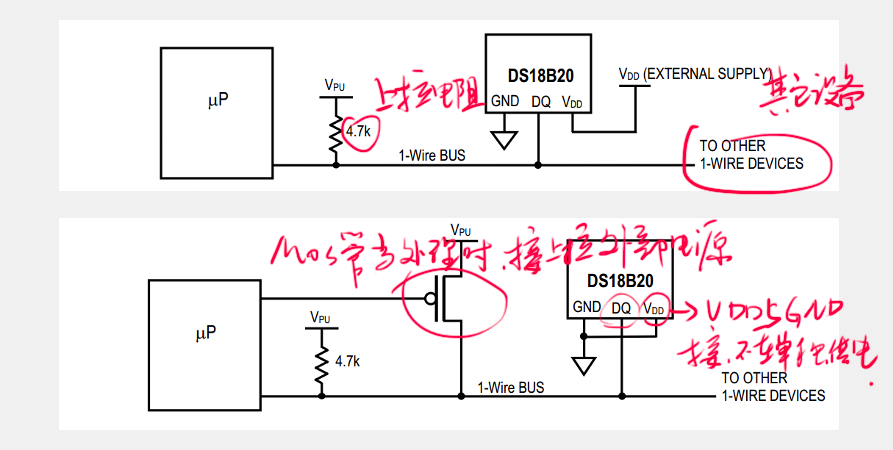
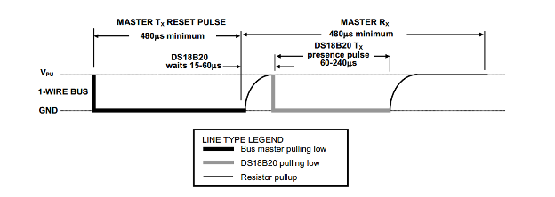
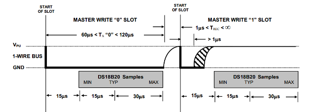
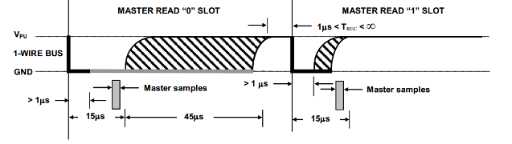
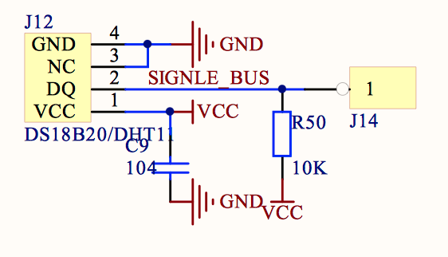
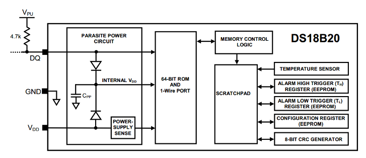
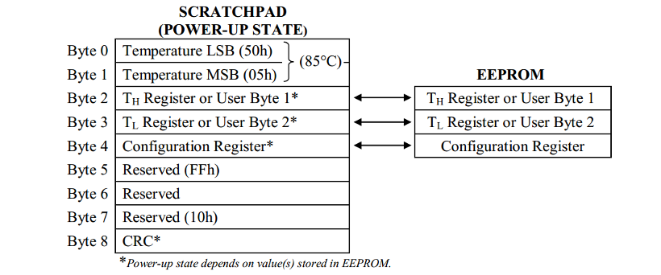
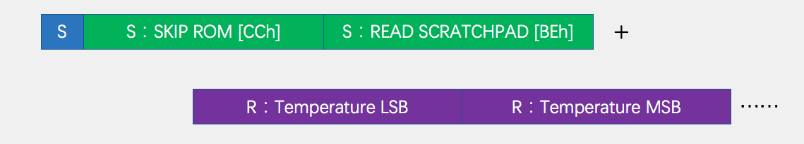

## DS18B20及单总线传输数据

### 单总线

* 单总线(1-Wire Bus)是由Dallas公司开发的一种通用数据总线
* 一根通信线：DQ
* 异步、半双工
* 单总线只需要一根通信线就可实现数据的双向传输，当采用寄生供电时，还可以省去设备的VDD线路，此时，供电加通信需要DQ和GND两根线

#### 单总线电路规范

* 设备的DQ均要配置成开漏输出模式
* DQ添加一个上拉电阻，阻值一般为4.7欧左右
* 若此总线的从机采取寄生供电，则主机还应配一个强上拉输出电路

#### 单总线时序结构
* 初始化: 主机将总线拉低至少480us，然后释放总线，等待15~60us后，存在的从机会拉低总线60~240us以响应主机，之后从机释放总线。

* 发送**一位**: 主机将总线拉低60~120us，然后释放总线，表示发送0；主机将总线拉低1~15us，然后释放总线，表示发送1。从机将在总线拉低30us后（典型值）读取电平，整个时间片应大于60us。

* 接收**一位**: 主机将总线拉低1~15us，然后释放总线，并在拉低后15us内读取总线电平(尽量贴近15us的末尾)，读取为低电平则为接收0，读取为高电平则为接收1，整个时间片应大于60us。

#### 接收/发送一个字节

* 发送一个字节：连续调用8次发送一位的时序，依次发送一个字节的8位（**低位在前**）。
* 接收一个字节：连接调用8次接收一位的时序，依次接收一个字节的8位（**低位在前**）。 

### DS18B20
* DS18B20是一种常见的数字温度传感器，其控制命令和数据都是以数字信号的方式输入和输出，相比较于模拟温度传感器，具有功能强大、硬件简单、易扩展、抗干扰性强等特点。
* 测温范围：-55度到+125度
* 通信接口: 1-wire(单总线)
* 其他特征：可形成总线结构、内置温度报警功能、可寄生供电

|引脚|功能|
|:----:|:----:|
|VDD|电源(3.0V~5.5V)|
|GND|GND|
|DQ|单总线接口|

#### 内部结构

* 64-BIT ROM：作为器件地址，用于总线通信的寻址。
* SCRATCHPAD(暂存器)：用于总线的数据交互
* EEPROM：用于保存温度触发阈值和配置参数

#### 存储器结构

### DS18B20操作流程

* 初始化：从机复位，主机判断从机是否响应
* ROM操作：ROM指令+本指令需要的读写操作
* 功能操作：功能指令+本指令需要的读写操作

|ROM指令|功能指令|
|:---:|:---:|
|SEARCH ROM[F0h]|CONVERT T[44h]|
|READ ROM[33h]|WRITE SCRATCHPAD[4Eh]|
|MATCH ROM[55h]|READ SCRATCHPAD[BEh]|
|SKIP ROM[CCh]|COPY SCRATCHPAD[48h]|
|ALARM SEARCH[ECh]|RECALL E2[D8h]|
||READ POWER SUPPLY[B4h]|

### DS18B20数据帧
* 温度变换：初始化->跳过ROM->开始温度变换

* 温度读取：初始化->跳过ROM->读暂存器->连续的读操作

