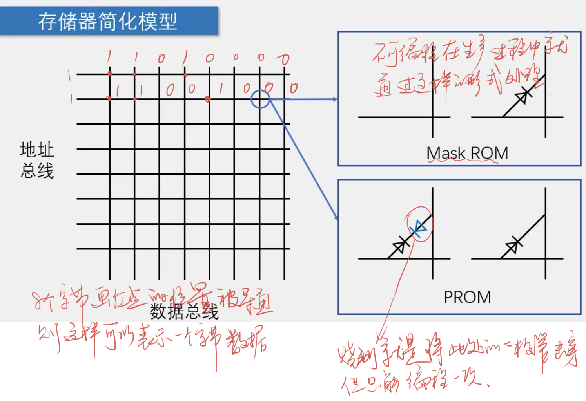

## I2C总线

### Ram/Rom相关



可以看到ROM是通过二极管来控制电路，PROM就是在出厂时会有两个"对头"的二极管，可以按照自身的需要来进行编程(击穿二极管)。这样电路就导通了。

通过网格的形式可以表示字节数据。

### AT24C02
* AT24C02是一种可以实现掉电不丢失的存储器，可用于保存单片机运行时想要永久保存的数据信息。
* 存储介质：E2PROM
* 通讯接口: I2C总线
* 容量: 256字节

#### 电路图


|引脚|功能|
|:---:|:---:|
|VCC、GND|电源(1.8V~5.5V)|
|WP|写保护高电平有效|
|SCL、SDA|I2C接口|
|A0、A1、A2|I2C地址|

### I2C总线介绍

* I2C总线(Inter IC BUS)是由Philips公司开发的一种通用数据总线
* 两根通信线: SCL(Serial Clock)、SDA(Serial Data)
* 同步、半双工，带数据应答
* 通用的I2C总线，可以使各种设备的通信标准统一，对于厂家来说，使用成熟的方案可以缩短芯片设计周期、提高稳定性，对于应用者来说，使用通用的通信协议可以避免
学习各种各样的自定义协议，降低了学习和应用的难度
  
### I2C电路规范
* 所有I2C设备的SCL连在一起，SDA连在一起
* 设备的SCL和SDA均要配置成开漏输出模式
* SCL和SDA各添加一个上拉电阻，阻值一般为4.7K欧左右
* 开漏输出和上拉电阻的共同作用实现了"线与"的功能，此设计主要是为了解决通信互相干扰的问题


### I2C时序结构

***一定要注意无论是接还是写都是SCL高电平期间才可以做!!!!!***

* **起始条件**: SCL高电平期间，SDA从高电平切换到低电平
* **终止条件**: SCL高电平期间，SDA从低电平切换到高电平


* **发送一个字节**: SCL低电平期间，主机将数据位依次放到SDA线上(高位在前)，然后拉高SCL，从机将在SCL高电平期间读取数据位，所以SCL高电平期间SDA不允许有数据变化，
依次循环上述过程8次，就可发送一个字节。
  


* **接收一个字节**: SCL低电平期间，从机将数据位依次放到SDA线上(高位在前)，然后拉高SCL，主机将在SCL高电平期间读取数据位，所以SCL高电平期间SDA不允许
有数据变化，依次循环上述过程8次，就可接收一个字节(主机在接收前，需要释放SDA)
  


* **发送应答**: 在接收完一个字节之后，主机在下一个时钟发送一位数据，数据0表示应答，数据1表示非应答
* **接收应答**: 在发送完一个字节之后，主机在下一个时钟接收一位数据，判断从机是否应答，数据0表示应答，数据1表示非应答(主机在接收之前，需要释放SDA)


* **I2C发送一帧数据**: 顺序为，开始->地址信息->应答->发送一字节->应答->发送一字节->应答->......->发送一字节->应答->结束


* **I2C接收一帧数据**: 顺序为，开始->地址信息->从机应答->接收一字节->主机应答->接收一字节->主机应答->.......->接收一字节->主机应答->结束 


* **I2C复合模式**


### AT24C02数据帧
* 字节写： 在WORD ADDRESS处写入数据DATA
* 随机读: 读出在WORD ADDRESS处的数据DATA
* AT24C02的固定地址为1010，可配置地址本开发板上为000所以SLAVE ADDRESS+W为0xA0，SLAVE ADDRESS+R为0xA1


```c
// 正确写法
void i2c_start()
{
    I2C_SDA = 1;
    // 这里要严格按照I2C的顺序来写
    // 只有SCL在高电平下才会处理SDA相关顺序
    I2C_SCL = 1;
    I2C_SDA = 0;
    I2C_SCL = 0;
}


// 错误写法
void i2c_start()
{
    I2C_SDA = 1;
    I2C_SCL = 1;
    
    // 这里顺序错就会引起问题
    I2C_SCL = 0;
    I2C_SDA = 0;
}

// 在SCL拉高电平之前可以更改SDA，顺序如果写成
/*
 *  I2C_SCL = 1;
 *  I2C_SDA = data & (0x80 >> i);
 *
 *  这样是无法正确写入数据的
 */
I2C_SDA = data & (0x80 >> i);
I2C_SCL = 1;
I2C_SCL = 0;


// 错误写法 一定要注意I2C的规则
I2C_SCL = 1;
I2C_SDA = data & (0x80 >> i);
I2C_SCL = 0;
```