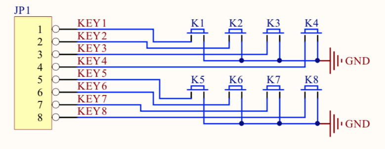
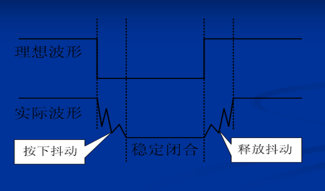
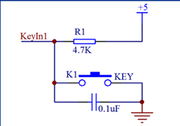
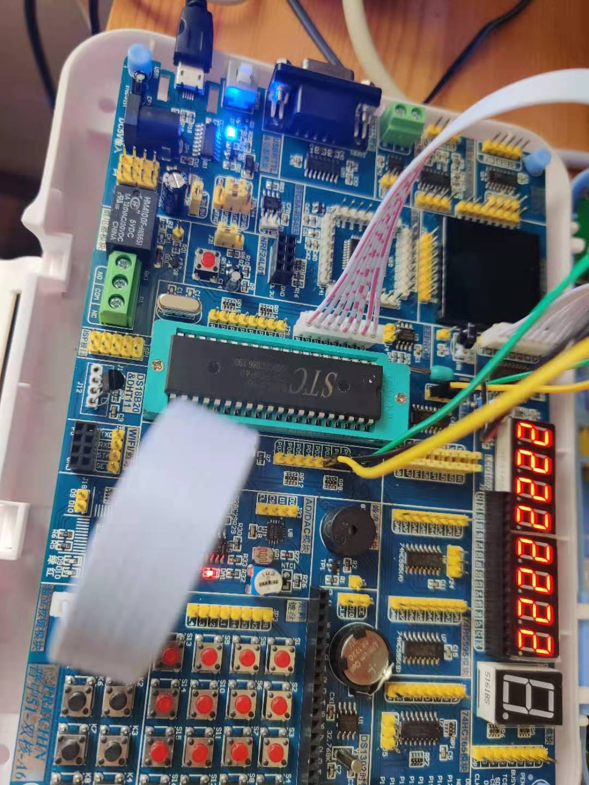

## 独立按键

### 基本电路



### 原理

轻触开关是一种电子开关，使用时，轻轻按开关按钮就可以使开关接通，当松开手时，开关断开。

芯片引出的端口是有上拉电阻的，是高电平，按键接地，那么当接通之后，会导通，这时候会变为低电平。 但是当按下或者释放的时候因为机械结构的原因，电压会有波动，那么为了更准备的处理这个问题，一般两种方法，**软件消抖**，**硬件消抖**。



1. 硬件消抖



2. 软件消抖，一般来说用户按下会有一个时间，在这个时间内再对按键进行一次检测，若发现还是低电平，则表示这个按键被按下。

### 接线



### 代码关键点

```c
// 这里是hex转 bin代码
for (j = 0; j < 8; j++) {
    num = t % 2;
    t /= 2;

    // 表明是第几位被按下
    if (num == 0) {
        int dnum = displayNum[j];
        dnum = dnum >= 9 ? 0 : dnum + 1;
        displayNum[j] = dnum;
    }
}
```