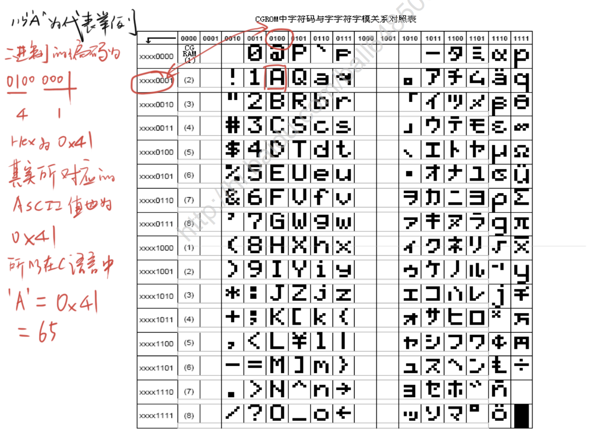

## LCD1602 液晶显示屏

### LCD1602介绍
* LCD1602(Liquid Crystal Display) 液晶显示屏是一种字符型液晶显示模块，可以显示ASCII码的标准字符和其它的一些内置特殊字符，还可以有8个自定义字符。
* 显示容量: 16\*2个字符，每个字符为5\*7点阵。

### 引脚及电路图

|引脚|功能|
|:---:|:---:|
|GND|GND|
|VCC|VCC(4.5~5.5V)|
|VO|对比度调节电压|
|RS|数据/指令选择，1为数据，0为指令|
|RW|读/写选择，1为读，0为写|
|E|使能，1为数据有效，下降沿执行命令|
|D0~D7|数据输入/输出|
|BG VCC|背光灯电源正极|
|BG GND|背光灯电源负极|

### 存储器结构

**DDRAM(数据显示区)**

|   |显示位置|1|2|3|4|5|6|7|.....|40|
|:---:|:----:|:----:|:----:|:----:|:----:|:----:|:----:|:----:|:----:|:----:|
|DDRAM地址|第一行|00H|01H|02H|03H|04H|05H|06H|.....|27H|
|DDRAM地址|第二行|40H|41H|42H|43H|44H|45H|46H|.....|67H|

CGRAM+CGROM(字模库)

### 读写时序图

### 指令集

从图上可知一般情况下需要以下几步来显示数据
1. 设置输入方式为，数据读、写操作后，AC自动加1，画面不动。发送`0x06`
2. 设置显示开关，显示开，光标关，闪烁关。发送`0x0C`
3. 功能设置，八位数据接口，两行显示，5x7点阵。发送`0x38`
4. 清屏。发送`0x01`

5. 设置AC `Cursor = 0x80|AC`
6. 发送数据 ...... continue

