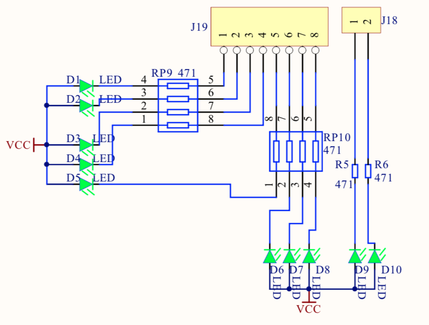
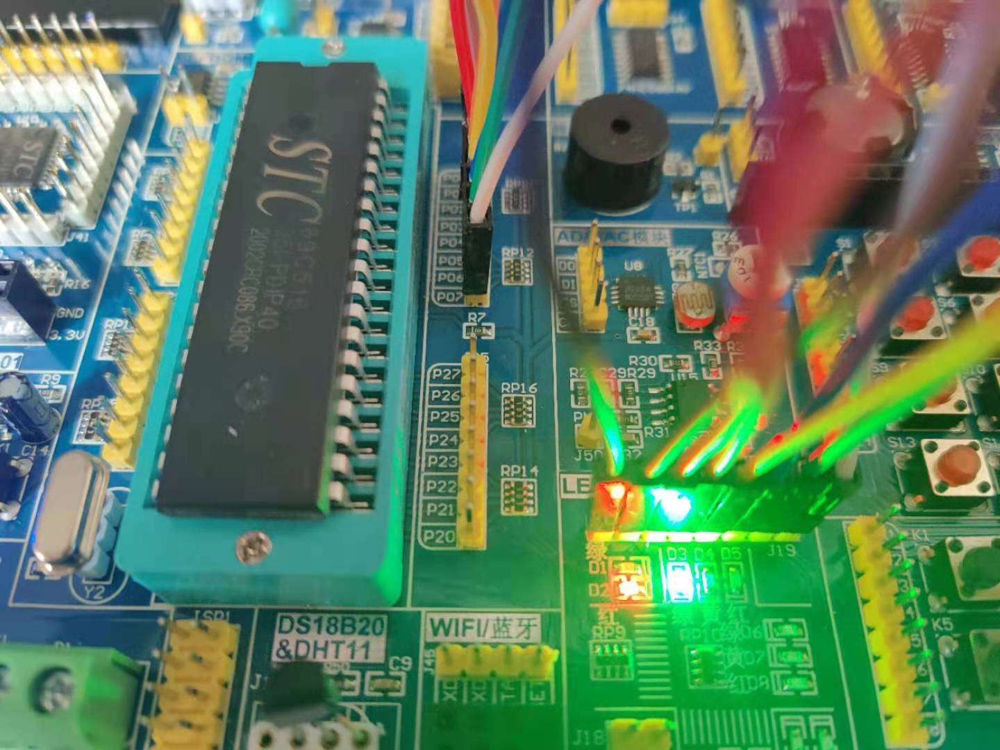

## LED

### 基本电路


### 原理
1. 芯片P00~P07可以输出信号 0 1，本质为高电平或低电平。
2. 二极管阳极接了VCC高电平。
3. 阴极接入了一个限流电阻以及P00~P07口。这个口默认会输出高电平。
4. 此时二极管没有压差，无法点亮，然后控制芯片输出低电平，形成压差，二极管导通点亮。

### 接线


### 代码关键点
```c
// 定义端口可以有两种方式，一种为具体定义，一种是可以使用16进制来定义
// 此时指定的端口就是P0 第 0 号端口
#define LED P0_0

// 定义一组端口
#define LED P0
// FE代表的二进制数为 1111 1110，这时就是第0号输出为低电平
LED = 0xFE;
// 此时就是第1号端口输出低电平 1111 1101
LED = 0xFD;
```