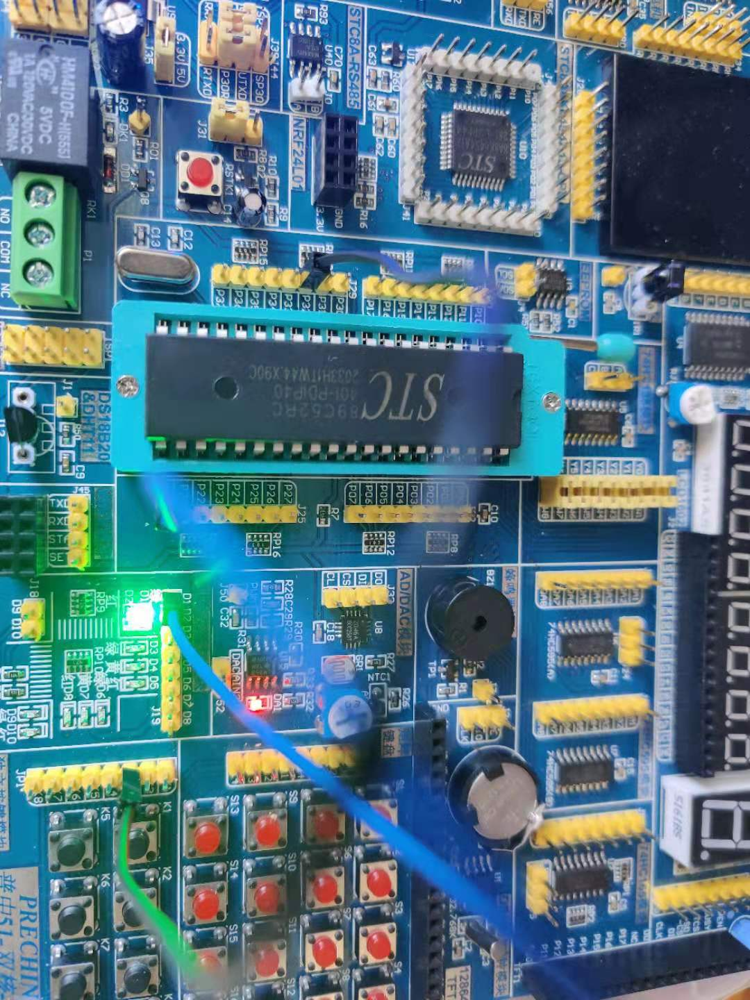

## 外部中断

### 原理

51单片机发生中断必须要满足以下3个条件，这个3个条件顺序可以任意:
1. 中断源有中断请求；
2. 此中断源的中断允许位为1；
3. CPU开中断(EA=1)。

比如对应的配置程序如下:
```c
EA = 1; // 打开总中断开关
EX0 = 1; // 开外部中断开关
IT0 = 1; // 设置外部中断的触发方式
```

`IT0 = 1`表示下降沿时会触发中断 -> IT0对应的是P3_2端口，外部中断的触发方式又是下降沿，则K3按钮在按下时电平从高平转为低电平。则会触发中断。

### 接线


### 关键代码
```c
void int0Init() {
    IT0 = 1;
    EX0 = 1;
    EA = 1;
}

void int0() __interrupt 0 { // 表示当interrupt 0时会触发这段代码。
    delay(1000);

    if (K3 == 0) {
        LED = !LED;
    }
}
```