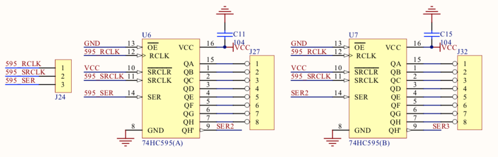
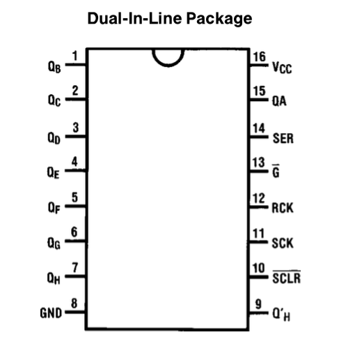
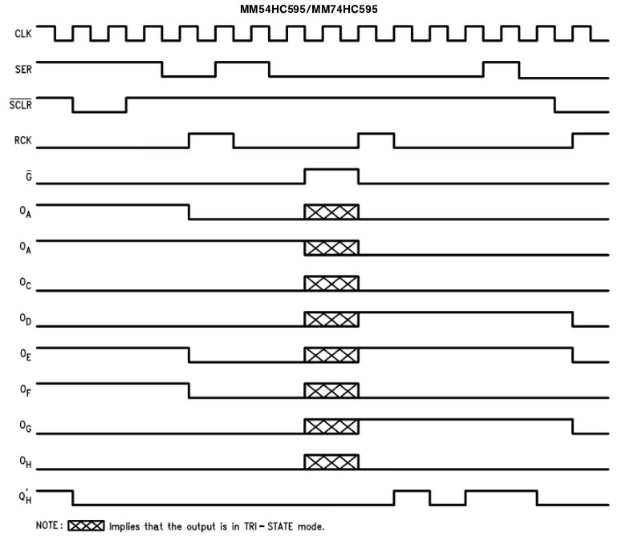
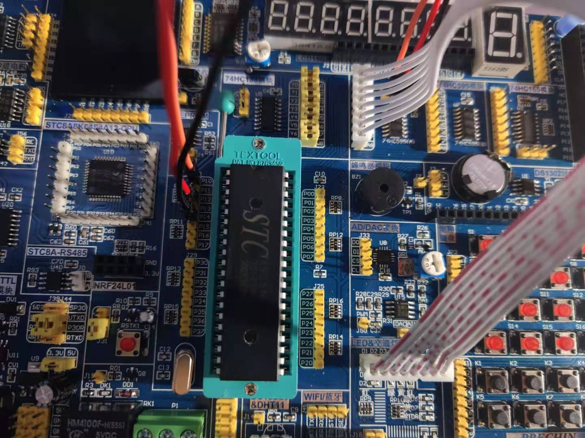

## IO扩展(串转并)

### 原理图


### 74HC595芯片

#### 管脚图


#### 真值表

|RCK|SCK|SCLR(低平)|G(低平)|Function|
|:----:|:----:|:-------:|:----:|:------|
|X|X|X|H|Qa thru Qh = TRI-STATE|
|X|X|L|L|Shift Register cleared Q'h = 0|
|X|↑|H|L|Shift Register clocked Qn=Qn-1, Q0 = SER|
|↑|X|H|L|contents of Shift Register transferred to output latches|


#### 时序图


#### 管脚说明
* SCLR(低平) 为主复位，当输入低电平时`Shift Register cleared Q'h = 0`就是会清除数据，将Q'h置为0。高电平时为工作状态。
* SCK 为移位寄存器时钟输入。
* SCK 为存储寄存器时钟输入。
* SER 为串行数据输入。
* G(低平) 为输出有效，若为高电平表现为高电阻，芯片不可用。

#### 原理
从电路图上可以看出SCLR常接VCC一直会是高电平，芯片一直是工作状态，G管脚接地，常为低电平状态不会出现高电阻的情况。
Q'h 会原封不动的将SER中的串口数据输出出去，这样就意味着可以再串联另一个芯片以供可以扩展更多的IO口。

SCK为上升沿时会把数据写入位移寄存器，规则是Qn=Qn-1, Q0 = SER
当写完再使用RCK为上升沿则将数据转移至寄存中，然后从Qa-Qh输出信号。

**也就是说以现在电路图设计来看，只占用了MCU三个管脚就可以控制8个并联口数据**这是这个芯片的最大好处，以及还可以再跟同样的芯片来串联，
达到更多的扩展。

### 接线图



### 代码关键点
```c
    // 从高到低发送数据
    SER = serData >> 7;
    serData <<= 1;
```