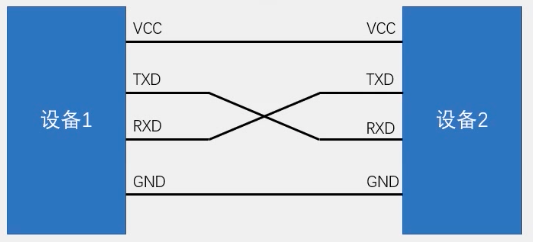
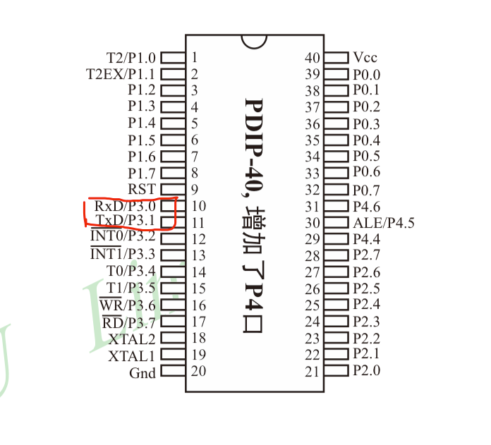
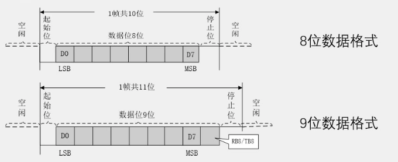
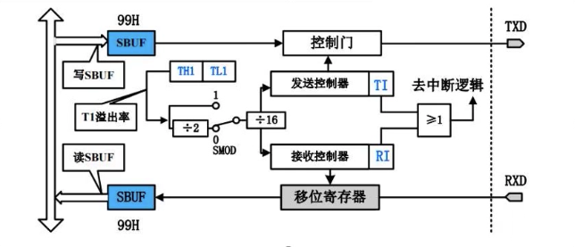
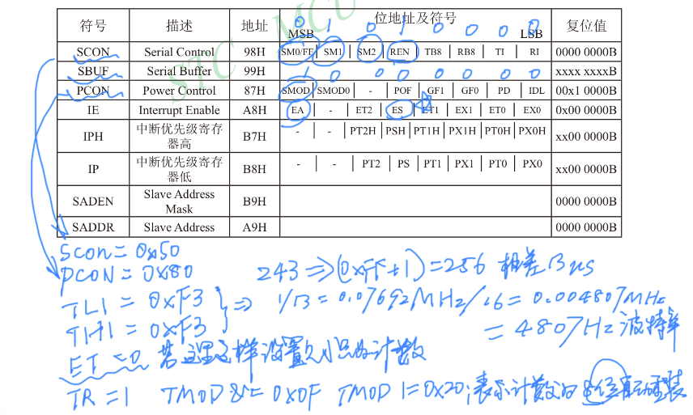

## 串口通信

### 串口介绍

* 串口是一种应用十分广泛的通讯接口，串口成本低、容易使用、通信线路简单，可实现两个设备的互相通信。
* 单片机的串口可以使单片机与单片机、单片机与电脑、单片机与各式各样的模块相互通信，极磊的扩展了单片机的应用范围，增强了单片机系统的硬件实力。
* 51单片机内部自带UART(Universal Asynchronous Receiver Transmitter,通信异步收发器),可实现单片机的串口通信。

### 硬件电路
* 简单的双向串口通信有两根通信线(发送端TXD和接收端RXD)
* TXD和RXD要交叉连接
* 当只需单向的数据传输时，可以直接一根通信线
* 当电平标准不一致时，需要加电平转换芯片

### 电平标准
* 电平标准是数据1和数据0的表达方式，是传输缆中人为规定的电压与数据的对应关系，串口常用的电平标准有如下三种
  * TTL电平：+5V表示1，0V表示0
  * RS232电平：-3~-15V表示1，+3~+15V表示0 
  * RS485电平：两线压差+2~+6V表示1，-2~-6V表示0（差分信号）
  
TTL电平以及RS232电平这两种表达方式传输的有效距离并不长，差分信号一般传输距离可以很长。主要原因是在于导体的温度对于电压的影响。

### 常见通信接口比较

|名称|引脚定义|通信方式|特点|
|:----:|:----:|:----:|:----:|
|UART|TXD、RXD|全双工、异步|点对点通信|
|I2C|SCL、SDA|半双工、同步|可挂载多个设备|
|SPI|SCLK、MOSI、MISO、CS|全双工、同步|可挂载多个设备|
|1-Wire|DQ|半双工、异步|可挂载多个设备|

此外还有CAN、USB等

* 全双工：通信双方可以在同一时刻互相传输数据
* 半双工：通信双方可以互相传输数据，但必须分时复用一根数据线
* 单工：通信只能有一方发送到另一方，不能反射传输

* 异步：通信双方各自约定通信速率
* 同步：通信双方靠一根时钟线来约定通信速率

* 总线：连接各个设备的数据传输线路（类似于一条马路、把路边各住户连接起来，使住户可以相互交流）

### 51单片机的UART
* STC89C52有一个UART
* STC89C52的UART有四种工作模式:
  * 模式0: 同步移位寄存器
  * 模式1: 8位UART，波特率可变（常用）
  * 模式2: 9位UART，波特率固定
  * 模式3: 9位UART，波特率可变

### 串口参数及时序图
* 波特率: 串口通信的速率(发送和接收各数据位的间隔时间)
* 较验位: 用于数据验证
* 停止位: 用于数据帧间隔

### 串口通信相关寄存器
