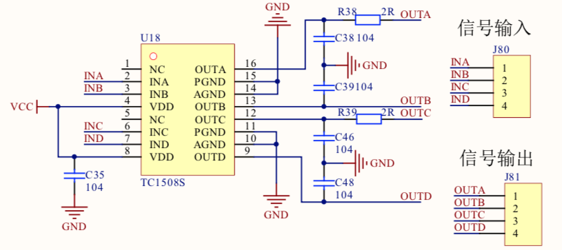
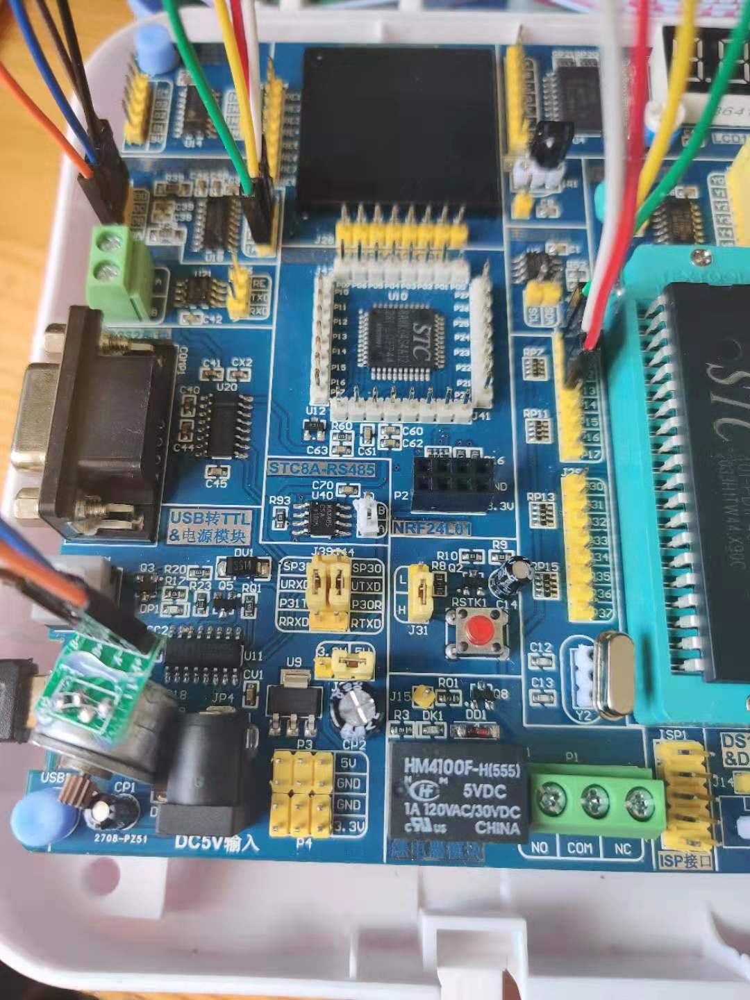

## 四线双极步进电机

步进电机是将电脉冲信号转变为角位移或线位移的开环控制元件。在非超载情况下，电机的转速、停止的位置只取决于脉冲信号的频率和脉冲数，而不受负载变化
的影响，就是给电机加一个脉冲信号，电机则转过一个步距角。这一线性系的存在，加上步进电机只有周期性的误差而无累积误差等特点，使得步进电机在速度、
位置等控制领域的控制操作非常简单。虽然步进电机应用广泛，但它并不像普通的直流和交流电机那样在常规状态下使用，它必须由双环形脉冲信号、功率驱动
电路等组成控制系统方可使用。

### 步进电机主要分类
* 永磁式(PM): 一般为二相，转矩和体积较小，步矩角一般为7.5度或15度。
* 反应式(VR): 一般为三相，可实现大转矩输出，步矩角一般为1.5度，但噪声和振动都很大。在欧美等发达国家80年代已经淘汰。
* 混合式(AB): 指混合了永磁式和反应式的优点。它又分为二相和五相，二相步距角一般为180度，而五相步距角一般为0.72度。这种步进电机应用最为广泛。

### 步进机主要技术指标

1. 相数:电机内部的线圈组数。 目前常用的有二相、 三相、 四相、 五 相步进电机。电机相数不同，其步距角也不同。一般二相电机的步距角为 0.9° /1.8°，三相为 0.75°/1.5°、五相为 0.36°/0.72°。在没有细分驱动器时， 用户主要靠选择不同相数的步进电机来满足自己步距角的要求。如果使用细分驱 动器，则“相数”将变得没有意义，用户只需在驱动器上改变细分数，就可以改 变步距角。
2. 步距角:表示控制系统每发一个步进脉冲信号， 电机所转动的角度。 电机出厂时给出了一个步距角的值， 如 86BYG250A 型电机的值为 0.9° /1.8° ( 表示半步工作时为 0.9° 、整步工作时为 1.8° ) ， 这个步距角 可称为“ 电机固有步距角” ， 它不一定是电机实际工作时的真正步距角， 真 正的步距角和驱动器有关。
3. 拍数:完成一个磁场周期性变化所需脉冲数或导电状态，或指电机转 过一个步距角所需脉冲数。以四相电机为例，有四相四拍运行方式，即 AB-BC-CD-DA-AB;四相八拍运行方式， 即 A-AB-B-BC-C-CD-D-DA-A。
4. 保持转矩:步进电机通电但没有转动时， 定子锁住转子的力矩。 它 是步进电机最重要的参数之一，通常步进电机在低速时的力矩接近保持转矩。由 于步进电机的输出力矩随速度的增大而不断衰减， 输出功率也随速度的增大而 变化，所以保持转矩就成了衡量步进电机最重要参数之一。比如，当人们说 2N·m 的步进电机时，在没有特殊说明的情况下，是指保持转矩为 2N·m 的步进电机。

### 电路原理图


### 接线图


### 代码关键点
```c
    // 通过更改频率来改变速度
    MOTOA = 1;
    MOTOB = 0;
    MOTOC = 1;
    MOTOD = 1;
    delay(200);

    MOTOA = 1;
    MOTOB = 1;
    MOTOC = 1;
    MOTOD = 0;
    delay(200);

    MOTOA = 0;
    MOTOB = 1;
    MOTOC = 1;
    MOTOD = 1;
    delay(200);

    MOTOA = 1;
    MOTOB = 1;
    MOTOC = 0;
    MOTOD = 1;
    delay(200);
```