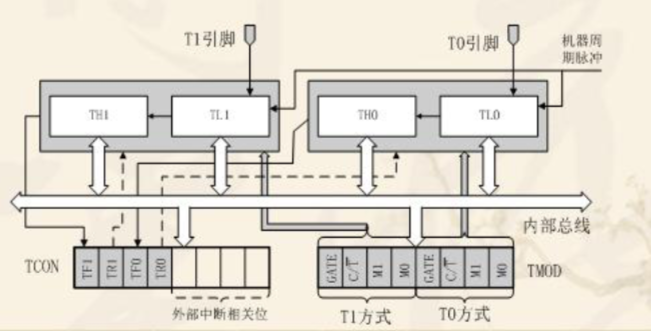
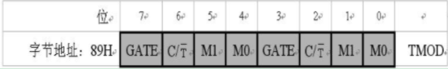
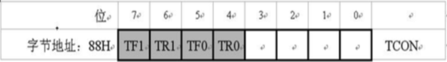
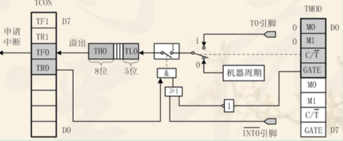
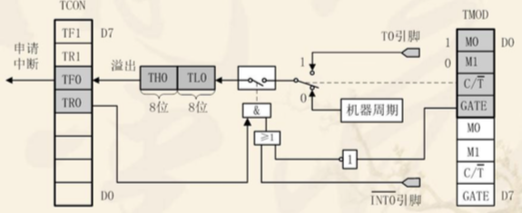
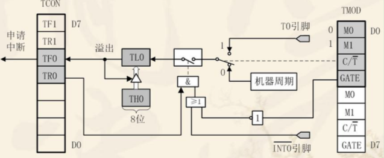
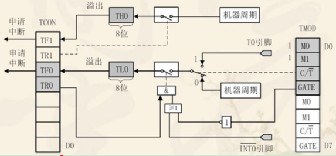
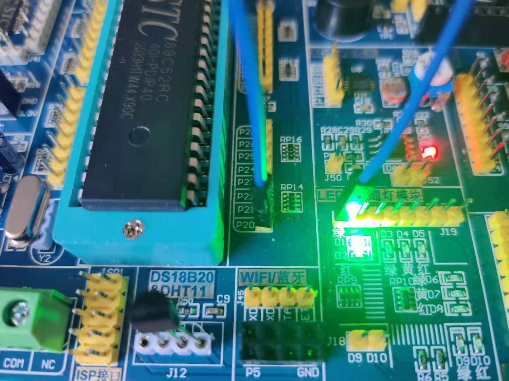

## 定时器中断实验

STC89C5X含有3个定时器：定时器0、定时器1、定时器2，但是并不是所有芯片有3个定时器，需要查看芯片手册确定。

### 定时器介绍

#### CPU时序有关知识
1. 振荡周期：为单片机提供定时信号的振荡的周期（晶振周期或外加振荡周期）。
2. 状态周期：2个振荡周期为1个状态周期，周S表示。振荡周期又称S周期或时钟周期。
3. 机器周期：1个机器周期含6个状态周期，12个振荡周期。
4. 指令周期：完成1条指令所占用的全部时间，它以机器周期为单位。

例如：外接晶振为12MHz时，51单片机相关周期的具体值为：
* 振荡周期=1/12us
* 状态周期=1/6us
* 机器周期=1us
* 指令周期=1~4us

#### 前置知识
1. 51单片机有两组定时器/计数器，因为可以定时，又可以计数，故称之为定时器/计数器。
2. 定时器/计数器和单片机的CPU是相互独立的。定时器/计数器工作的过程是自动完成的，不需要CPU参与。
3. 51单片机中的定时器/计数器是根据机器内部的时钟或者是外部的脉冲信号对寄存器中的数据加1。

有了定时器/计数器之后，可以增加单片机的效率，一些简单的重复加1的工作可以交给定时器/计数器处理。CPU转而处理一些复杂的事情。同时可以实现精
确定时作用。

### 单片机定时器原理
STC89C5X单片机内有两个可编程的定时/计数器T0、T1和一个特殊功能定时器T2。定时/计数的实质是加1计数器(16位)，由高8位和低8位两个寄存器
THx和TLx组成。它随着计数器的输入脉冲进行自加1，也就是每来一个脉冲，计数器就自动加1，当加到计数器为全1时，再输入一个脉冲就使计数器加零，
且计数器的溢出使相应的中断标志位置1，向CPU发出中断请求（定时器/计数器中断允许时）。如果定时/计数器工作于定时模式，则表示定时时间已到；
如果工作于计数模式，则表示计数值已满。可见，由溢出时计数器的值减去计数初值才是加1计数器的计数值。

#### 51单片机定时/计数器结构


上图中的T0和T1引脚对应的是单片机P3.4和P3.5管脚。51单片机定时/计数器的工作由两个特殊功能寄存器控制。TMOD是定时/计数器的工作方式寄存器，
确定工作方式和功能；TCON是控制寄存器，控制T0、T1的启动和停止及设置溢出标志。

1. 工作方式寄存器TMOD

工作方式寄存器TMOD用于设置定时/计数器的工作方式，低四位用于T0，高四位用于T1


GATE是门控拉，GATE=0时，用于控制定时器的启动是否受外部中断源信号的影响。只要用软件使TCON中的TR0或TR1为1，就可以启动定时/计数器工作；
GATE=1时，要用软件使TR0或TR1为1，周时外部中断引脚INT0/1也为高电平时，才能启动定时/计数器工作。此时定时器的启动条件，加上了INT0/1引脚
为高电平这一条件。

C/T；定时/计数模式选择位。C/T = 0为定时模式；C/T = 1为计数模式。

M1M0：工作方式设置位。定时/计数器有四中工作方式。

|M1M0|工作方式|说明|
:----:|:----:|:-----------|
|00|方式0|13位定时/计数器|
|01|方式1|16位定时/计数器|
|10|方式2|8位自动重装定时/计数器|
|11|方式3|T0分为两个独立的8位定时器/计数器；T1此方式停止计数|

2. 控制寄存器TCON

TCON的低4位用于控制外部中断，TCON的高4位用于控制定时/计数器的启动和中断申请。


TF1(TCON.7)：T1溢出中断请求标志位。T1计数溢出时由硬件自动置TF1为1。CPU响应中断后TF1由硬件自动清0。T1工作时，CPU可随时查询TF1的状态。
所以，TF1可用途查询测试的标志。TF1也可以用软件置1或清0，同硬件置1或清0的效果一样。

TR1(TCON.6)：T1运行控制位。TR1置1时，T1开始工作：TR1置0时，T1停止工作。TR1由软件置1或清0。所以，用软件可控制定时/计数器的启动与停止。

TF0(TCON.5)：T0溢出中断请求标志位，其功能与TF1类同。

TR0(TCON.4)：T0运行控制位，其功能与TR1类同。

#### 定时/计数器的工作方式
* 方式0

方式0为13位计数，由TL0的低5位(高3位未用)和TH0的8位组成。TL0的低5位溢出时向TH0进位，TH0溢出时，置位TCON中的TF0标志，向CPU发出中断
请求。



门控位 GATE 具有特殊的作用。当 GATE=0 时，经反相后使或门输出为 1，此 时仅由 TR0 控制与门的开启，与门输出 1 时，控制开关接通，计数开始;
当 GATE=1 时，由外中断引脚信号控制或门的输出，此时控制与门的开启由外中断引脚信号 和 TR0 共同控制。当 TR0=1 时，外中断引脚信号引脚的高电平启动计数，
外中断 引脚信号引脚的低电平停止计数。这种方式常用来测量外中断引脚上正脉冲的宽 度。计数模式时，计数脉冲是 T0 引脚上的外部脉冲。计数初值与计数个数的关系为
:X=2(13)-N。其中 2(13)表示 2 的 13 次方。

* 方式1

方式1的计数位数是16位，由TL0作为低8位，TH0作为高8位，组成了16位加1计数器。



计数实初值与计数个数的关系为：X = 2 (16)-N。

* 方式2

方式2为自动重装初值的8位计数方式。工作方式2特别适合于用作较精确的脉冲信号发生器。



计数初值与计数个数的关系为：X = 2 (8)-N。

* 方式3

方式3只适用于定时/计数器T0，定时器T1处于方式3时相当于TR1=0，停止计数。工作方式3将T0分成为两个独立的8位计数器TL0和TH0。



### 定时器配置

在使用定时器，应该如何配置使其工作，步骤如下(各步骤顺序可任意):
1. 对TMOD赋值，以确定T0和T1的工作方式，如果使用定时器0对T0配置，如果使用定时器1对T1配置。
2. 根据所要定时的时间计算初值，并将其写入TH0、TL0或TH1、TL1。
3. 如果使用中断，则对EA赋值，开放定时器中断。
4. 使TR0或TR1置位，启动定时/计数器定时或计数。

#### CPU操作时间

机器周期 = 1 / 单片机的时钟频率。51单片机内部时钟频率是外部时间的12分频，也就是说当外部晶振的频率输入到单片机里面的时候要进行12分频。比如说你用的是
12MHz晶振，那么单片机内部的时钟频率就是12/12MHz，当你使用12MHz的外部晶振的时候，机器周期=1/1M = 1us。如果我们想定时1ms的初值是多少呢？1ms/1us = 1000。
也就是要计数1000个，初值=65535-1000+1 （因为实际上计数器计数到66636 2的16次方 才溢出，所以后面要加1）= 64536 = FC18H，所以初始值为THx = 0xFC，TL=0x18。

知道了如何计算定时/计数器初值，那么想定时多长时间都可以计算出，当然由于定时计数器位数有限，我们不可能直接通过初值定时很长时间，如果要实现很长时间的定时，比如
定时1秒钟。可以通过初值设置定时1ms，每当定时1ms结束后又重新赋初值，并且设定一个全局变量累计定时1ms的次数，当累计到1000次，表示已经定时1秒了。需要
其他定时时间类似操作，这样我们就可以使用定时器来实现精确延时来替代之前的delay函数。

这里以定时器0为例介绍配置定时器工作方式1、设定1ms初值，开启定时器计数功能以及总中断
```c
void timer0Init() {
    TMOD |= 0x01; // 选择为定时器0模式，工作方式1，仅用TR0打开启动
    
    TH0 = 0xFC; // 给定时器赋初值，定时1ms
    TL0 = 0x18;
    ET0 = 1; // 打开定时器0中断允许
    EA = 1; // 打开总中断
    TR0 = 1; // 打开定时器
}
```

### 连接图



### 代码关键点
```c
void timer0() __interrupt 1 {
    static uint i;
    TH0 = 0xFC;
    TL0 = 0x18;
    i++;

    if (i == 1000) {
        i = 0;
        LED = !LED;
    }
}
```